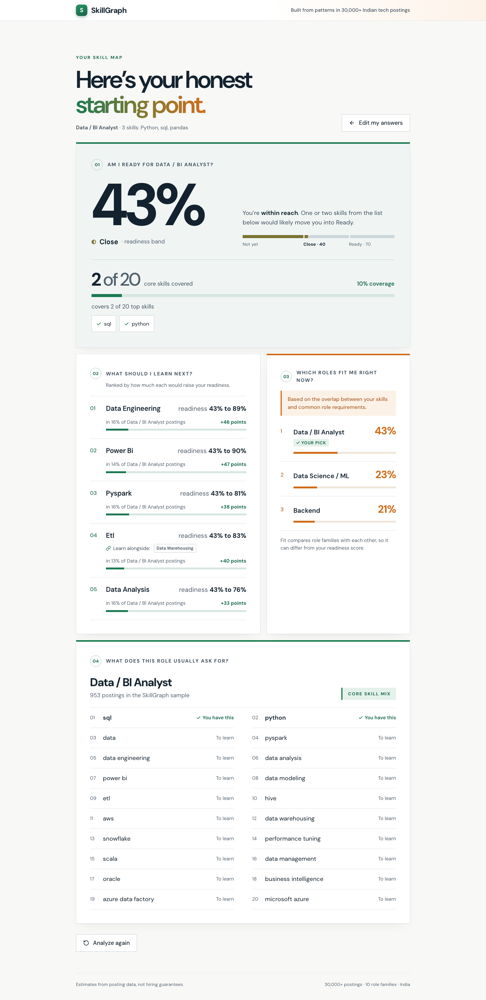
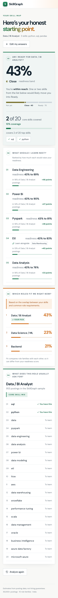
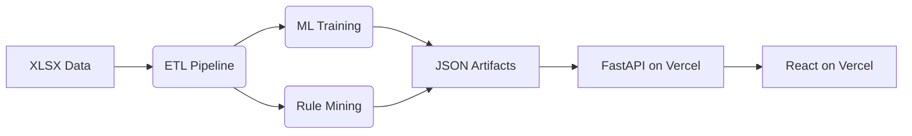

# SkillGraph: India Job Market Mining Engine

Live Application: https://skillgraph-exp.vercel.app




## What It Does
- Extracts and normalizes skills from unstructured job postings.
- Classifies user skills into one of 10 tech roles using a machine learning model.
- Recommends skill gaps to learn next based on association rules mined from the tech posting subset.

## Architecture



## Quick Start

```bash
make setup
make api
make web
```

## Full Rebuild

```bash
make all
```

## Key Numbers
- **Dataset**: 97,929 raw rows, 34,569 baskets
- **Normalization**: 69.9% mapped mass
- **Model**: 0.7499 Test Macro F1
- **Mining**: 231 rules
- **Engineering**: 2521.1 ms cold start latency, 454.4 ms p50 latency

## Limitations
- 8-tag cap per job posting input.
- "Software Engineer (generic)" generic titles are excluded.
- Data represents posted demand, not hired skills.
- No usable posting dates in the source data, so a random split was used.
- Short-input F1 drops significantly.
- Overconfident top bin in the model calibration.
- Covers India tech postings only.

## Team

| Name | GitHub | Role |
| - | - | - |
| Atul | AtulACleaver | ETL |
| Aditya | | ML |
| Aryan | eccentricAryan404 | Mining and Taxonomy |
| Archit | Archit1302-wolf | API |
| Shashank | ssp0009 | Frontend |